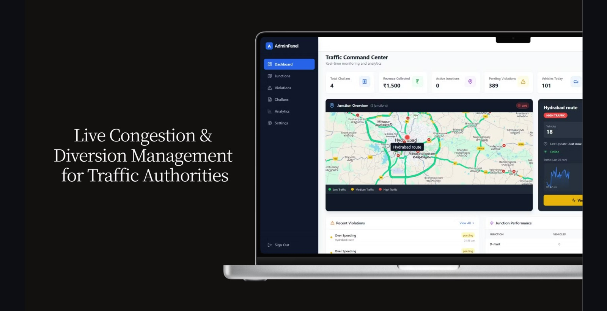
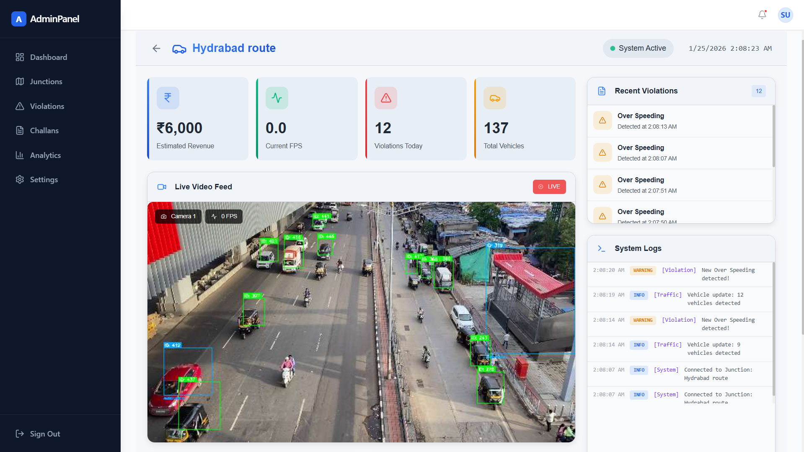
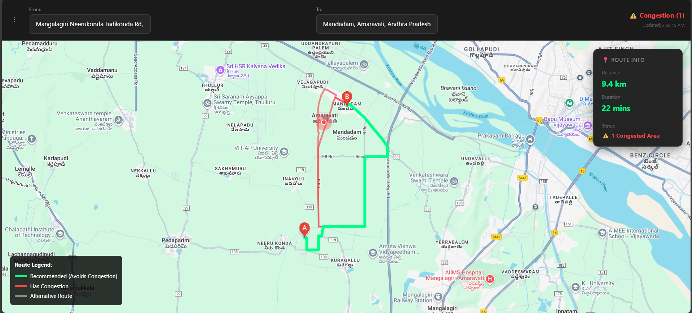
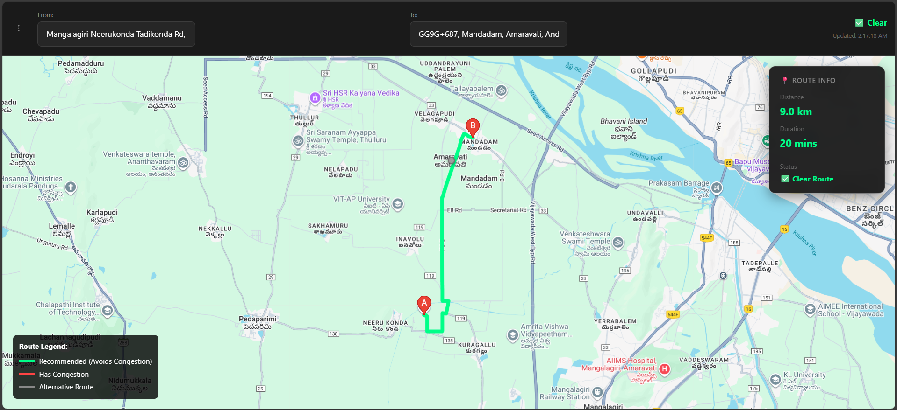
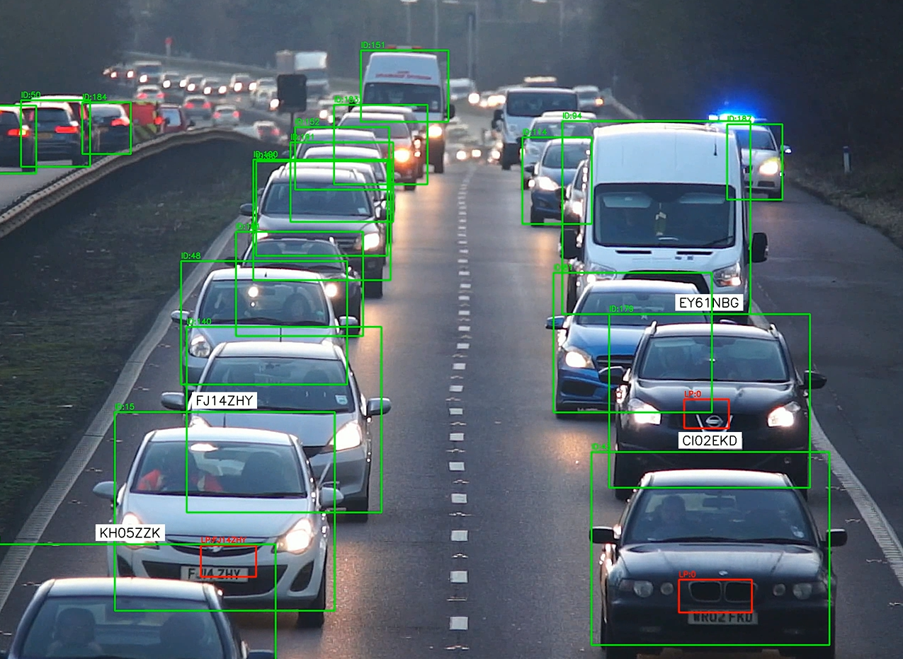
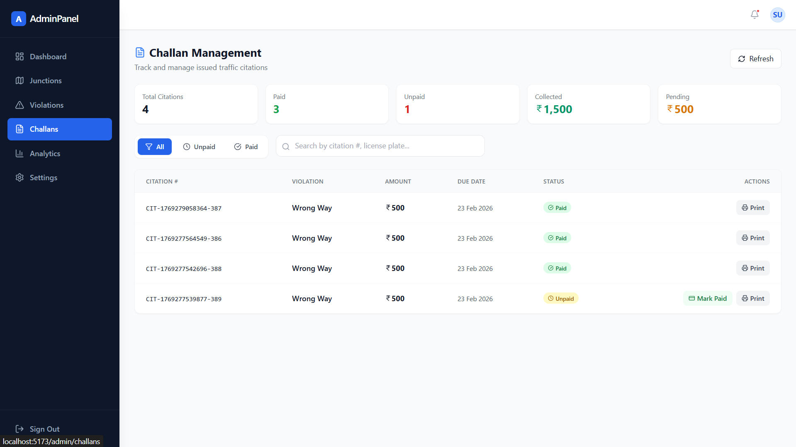
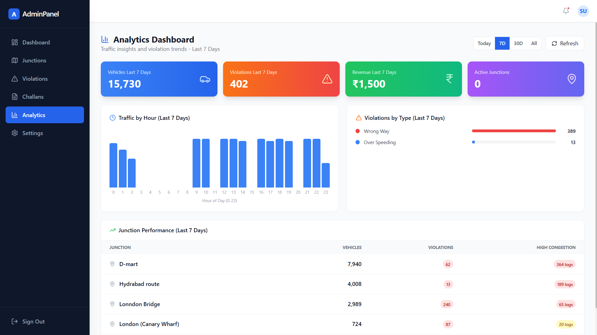
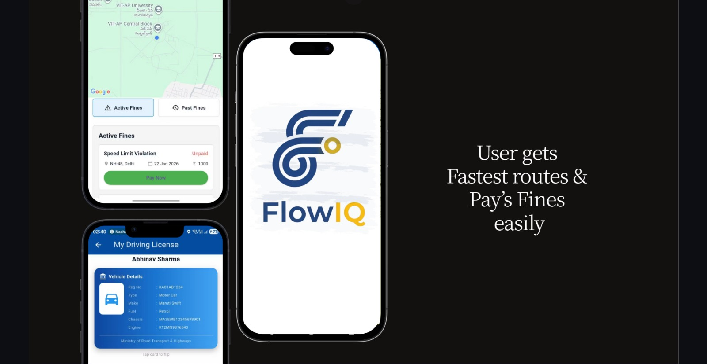

# 🚦 AI-Integrated Smart Mobility & Urban Safety System

[](https://smart-mobility-and-urban-safety-sys.vercel.app/)
[](https://opensource.org/licenses/MIT)


> **A scalable, AI-powered system for real-time traffic monitoring, intelligent signal control, and automated violation detection.**

This project leverages distributed **Edge AI (Worker Nodes)** to process video feeds at traffic junctions and synchronizes data with a centralized **Cloud Dashboard** for city-wide traffic management.

---

## 📸 System Previews

### 1. Admin Dashboard
Comprehensive view of city traffic, active junctions, and real-time statistics.


### 2. Intelligent Junction Monitoring
Deep dive into specific junctions with live video feeds, real-time vehicle counting, and congestion heatmaps.


### 3. Smart Route Planning (User View)
The public-facing route planner that adapts to real-time congestion levels.
**Before Congestion:**

**After Congestion Detected (Auto-Rerouting):**


---

## 🏗️ System Architecture

The system follows a **Hybrid Edge-Cloud Architecture**:

1.  **Edge Layer (Worker Nodes)**:
    *   **Technology**: Python, YOLOv8, OpenCV, SORT Tracker.
    *   **Role**: Deployed at physical junctions. They process raw video locally to extract structured data (vehicle counts, speeds, violations) and upload compressed snapshots.
    *   **Privacy**: Only metadata and violation evidence are stored; raw video streams are processed on-the-fly.

2.  **Cloud Layer (Supabase)**:
    *   **Technology**: PostgreSQL, Realtime Subscriptions, Storage Buckets.
    *   **Role**: Acts as the central nervous system, syncing state between workers and the dashboard in milliseconds.

3.  **Application Layer (Frontend)**:
    *   **Technology**: React, Vite, Google Maps API, Recharts.
    *   **Role**: Provides interfaces for both Administrators (Traffic Control Center) and Citizens (Smart Route Planner).

---

## 🧩 Key Features

### 🛡️ For Administrators (Traffic Control)
*   **Live Surveillance**: View real-time snapshots (1 FPS) from any connected junction.
*   **Automated Violation Detection**:
    *   **Wrong Way Driving**: Detects vehicles moving against traffic flow.
    *   **Over Speeding**: Identifies vehicles exceeding speed limits.
    *   **Deep Evidence**: Captures high-res cropped images of violations with license plates.
    
*   **Challan Management**: Workflow to review, approve, or reject automated citations.

*   **Analytics**: Historical data trends for traffic volume and revenue estimation.


### 🚗 For Citizens (Commuters)
*   **Smart Navigation**: Route suggestions that realistically account for current junction congestion levels.
*   **Congestion Awareness**: Visual indicators for high-traffic zones.

### 📱 Mobile Application (Citizen App)
*   **Companion App**: A dedicated mobile application for citizens to receive traffic alerts and navigate.
*   **Source Code**: Available at [xeyynon/TUA](https://github.com/xeyynon/TUA).



### 🔐 Admin Access (demo)
*   **Email**: `vectorvector369@gmail.com`
*   **Password**: `123456`

---

## 📂 Project Structure

```bash
📦 Root
├── 📂 frontend/             # React Application (Vite)
│   ├── 📂 src/
│   │   ├── 📂 admin/       # Admin Panel Components (Dashboard, Violations, etc.)
│   │   ├── 📂 pages/       # Public Pages (Route Planner)
│   │   └── key_components  # common UI elements
│   └── ...
│
├── 📂 worker/               # Python Edge Worker
│   ├── 📂 core/            # AI Logic (YOLO, Tracker, Rules)
│   ├── 📂 services/        # Supabase Communication
│   ├── 📂 sort/            # SORT Tracking Algorithm
│   ├── 📂 images/          # Documentation Assets & Screens
│   ├── config.py           # Worker Configuration (Junction ID, Source)
│   └── processor.py        # Main Processing Loop
│
├── 📂 database/             # SQL Scripts
│   ├── admin_schema.sql    # Main Database Setup
│   └── ...                 # Utility scripts
│
└── 📂 backend/              # (Legacy) FastAPI service
```

---

## 🚀 Getting Started

### Prerequisites
*   **Python 3.9+** (Telemtry & Vision)
*   **Node.js 18+** (Dashboard)
*   **Supabase Account** (Database)

### 1. Worker Setup (The "Edge")
The worker simulates a camera feed processing unit.

1.  Navigate to `worker/`:
    ```bash
    cd worker
    ```
2.  Install dependencies:
    ```bash
    pip install -r requirements.txt
    ```
3.  Configure `config.py` (Set your video file and ID):
    ```python
    JUNCTION_ID = 5
    VIDEO_SOURCE = "Videos/sample.mp4"
    ```
4.  Run the worker:
    ```bash
    python main.py
    # or use the batch script:
    ..\run_worker.bat
    ```

### 2. Frontend Setup (The "Cloud Dashboard")
1.  Navigate to `frontend/`:
    ```bash
    cd frontend
    ```
2.  Install dependencies:
    ```bash
    npm install
    ```
3.  Start the development server:
    ```bash
    npm run dev
    ```
4.  Open `http://localhost:5173` to see the Route Planner.
5.  Access Admin Panel via the **Menu (Top-Left)** or at `http://localhost:5173/admin/login`.

---

## 🧠 AI Methodology

### Vehicle Detection & Tracking
*   **Model**: YOLOv8n (Nano) is used for high-speed, low-latency detection suitable for edge devices.
*   **Tracking**: SORT (Simple Online and Realtime Tracking) assigns unique IDs to vehicles to track their trajectory across frames.

### Speed & Violation Logic
*   **Speed Estimation**: Calculated using **Pixels-Per-Meter (PPM)** mapping. By measuring the pixel displacement of a tracked vehicle over time, we estimate physical speed.
*   **Wrong Way**: We analyze the vector direction of the vehicle track. If `dy` (vertical movement) opposes the lane direction by a significant threshold (e.g., >20px), a violation is flagged.

### Emergency Vehicle Priority
*   **Detection**: A specialized logic checks for specific vehicle classes (Ambulance/Fire Truck) or color patterns.
*   **Action**: The system logs the event with high priority, intended to trigger "Green Corridor" signal changes (simulated in logs).

---
