# Smart Mobility & Urban Safety System 🚦


**A scalable, AI-powered system for real-time traffic monitoring, management, and violation detection.**
This system utilizes distributed "Edge Workers" to process video feeds at traffic junctions and syncs live analytics to a centralized Cloud Dashboard for city officials.

---

## 🏗️ System Architecture

```mermaid
graph TD
    %% Styling
    classDef edge fill:#f9f,stroke:#333,stroke-width:2px;
    classDef cloud fill:#bbf,stroke:#333,stroke-width:2px;
    classDef user fill:#bfb,stroke:#333,stroke-width:2px;

    subgraph Edge_Layer ["📷 Edge Layer (Python Workers)"]
        Camera[("🎥 CCTV Feed")] --> Worker["🖥️ AI Worker Node<br/>(YOLOv8 + OpenCV)"]
        Worker -->|Detects| Logic["🧠 Logic: Congestion, Speed, Violation"]
    end

    subgraph Backend_Layer ["☁️ Cloud Backend (Supabase)"]
        Logic -->|Sync Data| DB[("🗄️ Database")]
        Logic -->|Upload Media| Storage["📦 Storage"]
        DB -->|Realtime Push| Frontend
    end

    subgraph Frontend_Layer ["💻 Dashboard (React)"]
        Frontend -->|Admin Panel| Admin["🛡️ Admin Controls"]
        Frontend -->|Public Map| Map["🗺️ Public Traffic Map"]
    end
```



---

## 🔄 How It Works (Workflow)

### 1. The Edge Worker (The "Eyes")
*   **Input**: The Python script (`worker/`) connects to a CCTV camera or video file.
*   **Processing**:
    *   **YOLOv8** detects vehicles (Car, Truck, Bus, Motorcycle).
    *   **SORT Tracker** assigns a unique ID to each vehicle to track its path.
    *   **Logic Engine** calculates speed (pixels/frame), checks for red-light violations, and detects ambulances.
*   **Sync**: Every few seconds, it sends a summary (Traffic Density, Speed) to **Supabase**. If a violation occurs, it uploads the image immediately.

### 2. The Cloud (The "Brain")
*   **Supabase** acts as the central hub.
*   **Database**: Stores `traffic_logs`, `violations`, and `junctions` metadata.
*   **Realtime**: Instantly broadcasts updates (via WebSockets) to anyone viewing the map.

### 3. The Frontend (The "Face")
*   **Public Map**: Users see live traffic congestion (Red/Green lines) based on real-time data.
*   **Admin Dashboard**: City officials monitor the health of every junction (FPS, CPU) and review violations.

---

## ✨ Key Features

### 🧠 Edge AI (Python Workers)
*   **Vehicle Counting:** Real-time counting of Cars, Buses, Trucks, Motorcycles.
*   **Speed Estimation:** Pixel-distance mapping to estimate flow speed.
*   **Violation Detection:** Automatically flags **Red Light Violations** and **Wrong-Way Driving**.
*   **Emergency Priority:** Detects **Ambulances** and triggers alert events.

### 💻 Frontend Dashboard (React + Vite)
*   **Live Traffic Map:** Google Maps integration showing real-time congestion (Blue=Low, Red=High).
*   **Smart Rerouting:** Automatically calculates alternative routes when congestion is detected.
*   **Admin Panel:**
    *   Secure Login with RBAC (Role-Based Access Control).
    *   Junction Management (Configure workers remotely).
    *   Violation Review System (Approve/Reject challans).

---

## 📂 Project Structure

| Directory | Description |
| :--- | :--- |
| **[`frontend/`](./frontend)** | The React Application (Public Map + Admin Panel + Route Planner). |
| **[`worker/`](./worker)** | Python Edge Code. Runs YOLOv8 inference and communicates with Supabase. |
| **[`database/`](./database)** | SQL Schemas (`admin_schema.sql`) and Admin Setup Scripts. |
| **[`legacy/`](./legacy)** | Archived backend server (FastAPI), kept for reference. |
| **[`docs/`](./docs)** | Detailed documentation updates. |
| **[`scripts/`](./scripts)** | Batch scripts for dependency installation. |

---

## 🚀 Quick Start Guide

### 1. Database Setup (Supabase)
To run this project, you need a Supabase project.
1.  Go to the **[`database/`](./database)** folder.
2.  Run **`admin_schema.sql`** in your Supabase SQL Editor to create tables.
3.  Run **`fix_admin_rls.sql`** to apply security policies.
4.  (*Optional*) Run **`add_admin_user.sql`** to grant yourself Admin access.

### 2. Configure Environment
Create a `.env` file in the root or `worker/` directory:
```ini
SUPABASE_URL=https://your-project.supabase.co
SUPABASE_KEY=your-anon-key
```

### 3. Start the Edge Worker
Simulate a traffic junction processing video:
```powershell
.\run_worker.bat
```
*The worker will start processing `sample.mp4` and syncing data.*

### 4. Start the Dashboard
Launch the web interface:
```powershell
cd frontend
npm run dev
```
> Access: `http://localhost:5173`
> Admin Login: `http://localhost:5173/admin/login`

---

## 🛠️ How to Add a New Junction

You can simulate multiple traffic nodes by running multiple workers or simply changing the configuration.

1.  Open **`worker/config.py`**.
2.  Change the **Identity**:
    ```python
    JUNCTION_ID = 5           # Give it a unique number
    LOCATION_NAME = "My New Road"
    LATITUDE = 17.456        # Set coordinates
    LONGITUDE = 78.456
    ```
3.  (Optional) Tune Calibration:
    ```python
    SPEED_CALCULATION_FPS = 30 # Match your video FPS
    ```
4.  **Run the Worker**:
    ```powershell
    .\run_worker.bat
    ```
5.  **Result**: The new junction automatically appears on the **Admin Dashboard** and **Public Map**! 🚀

---

## 🛡️ Admin Access
The Admin Panel is protected. To log in:
1.  Create a user in Supabase Authentication.
2.  Run the **`database/add_admin_user.sql`** script to link that user to the `super_admin` role.
3.  Login with your email/password.

---

## 🤝 Technology Stack
*   **Frontend Check**: React 19, Tailwind CSS (v3), Google Maps API, Recharts.
*   **Backend**: Supabase (PostgreSQL 15, Realtime, Storage).
*   **AI/ML**: Python 3.9+, YOLOv8 (Ultralytics), OpenCV, PyTorch.

---

*© 2026 Smart Mobility Team*
